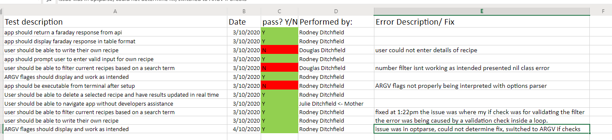

# RecipeFinder Terminal App

## GitHub

[Github repo location](https://github.com/R-dr/Recipes-app)

## Installation and Setup

1. Install ruby, we recommend using [asdf](https://asdf-vm.com/)

2. Install [git](https://git-scm.com/downloads)

3. `git clone` the app to your home directory

```bash
git clone https://github.com/R-dr/Recipes-app ~/Recipes_app
```

4. Run the `setup` executable file

```bash
~/Recipes_app/bin/setup
```

5. Open your `.bash_profile` in a text editor

6. Add this line

```bash
export PATH=$PATH:$HOME/Recipes_app/bin
```

7. Restart your terminal to make sure `.bash_profile` loads the app into your PATH

8. Run the `Recipes_app` executable to start the app

```bash
Recipes_app
```
scroll to the bottom to view default github readme

## Software Development Plan
### statement of purpose and scope
#### What will this application do?
the application is a digital recipe book which allows the user to be more creative than they normally would be.

#### What problem is this application solving?
The answer to this is quite simple, i'm a chef and i still struggle with deciding what to eat each night some nights i just end up ordering uber eats instead of using the food i have bought. This causes a lot of wastage but with the use of this app i've personally stopped this practise and am finding myself enjoying dinner once again.

#### Who is the target audience?
Anyone and everyone who is tired of always eating Mc Donalds late at night just because they couldn't decide what to eat for dinner. Or anyone who wants to cut down their food wastage or really just wants to be more creative in the kitchen.

## Features
- The user has the ability to access a external api through the use of Faraday gem
- The user may add delete or filter saved recipes and chose if they want to keep a recipe retrieved from the api or not, the recipe is stored in memory then shown to the user should they decide they want to see the recipe, the user is then given the choice to either save the recipe or not. only at this point is the recipe converted into a readable format for the program to write to the JSON file and store it for later use.
- Each time the menu is refreshed a random food themed joke is selected and displayed for the user, so far i'd rate these 7/10, my personal favorite so far is "it's smart to be friends with babies, thats free cake once a year for life!"
- The app is rather simple to use as well so i feel this makes it's accessability a prominent feature

## Outline of User Interaction

- The user can learn about how to interact with the app by passing either '-h' or '-help' as an ARGV input 
- They can also see all the available functions of the app via the menu, the menu is using the tty-prompt gem to ensure it's legible and much easier to use instead of just taking in raw user input
- Error are handled with control flow
  - An example of error handling is, should the user attempt to write their own recipe but miss any of the input fields the app simply returns them to the main menu and prompts them to enter something for each input rather than allowing them to enter a nill field which results in a blank string and in some cases breaks the apps interface of displaying data 
- The user can simply access their saved recipes and delete them with ease by using a number beside the recipe 
- The user has access to a multitude of recipes which are supplied by [Spoonacular Api](https://spoonacular.com/)


## Project Management

I used Trello to manage the different tasks that needed to be done.

Here is a link to [my board](https://trello.com/b/vckpMdRt/recipes-app).
## Dev log follows

23rd sept 2020 
- Recieved project 
- brainstormed ideas and chose a Recipe finding app, was approved by senior devs
- began work on project gem selection: tty-propmt, colorize, terminal table. began seearching for 4th gem 
24th sept 2020
- discovered 4th gem 'gosu' 
- Had idea of making a game instead, ran it by senior Dev approved if i could work it into the brief.
- began development of 'sheepish'
- made sheepish trello board
25th-27th sept 2020
- sheepish was completed and MVP for brief
28th sept 2020
- asked seperated Dev for advice on using gosu, was informed gosu is not technically a terminal app gem 
- scrapped sheepish 
- back on Recipe app
- made new recipe app trello board
29th sept2020
- began coding recipe app starting with how to use the Spoonacular api, discovered Faraday ruby gem. now have enough gems to fill brief
- struggled with api return not sure of how to read and gather data properly
30th sept 2020
- figured out how to gather data and interpret data from api return, began using spoonacular in project 
- saved spoonacular return to Json file 
1 oct 2020
- began on menu file and added a template to store users input from a demo performed in class 
- menu almost completed
2 oct 2020 
- menu thought to be finished 
- added more use of the faraday gem 
- squashed and bugs i encountered in my use of the app 
3 oct 
- had parents test app until they broke it, it took all of 5 minutes before a bug was discovered 
- repeted above step until i found no more potential bugs
- added bash script and implemented the file being executable from comand line.
4th oct 
- fixed ARGV input not being read 
- app is completed for project but will revisit and refine app for future use 


## Diagram


## Tests

i ran self tests constantly, here is a log of my final  manual tests

i attempted to use Rspec to test my app but found myself getting a little lost in what to test based on my own logic. i've included the rspec file as well hopefully you can see what i was trying to test and that it should have worked or not but as it stands i hope my own manual test and attempts to break my code will suffice 

# default github README follows here
Welcome to my first app it's a recipe finder app which grabs a random recipe from the spoonacular api, you can sign up [here](https://spoonacular.com/) for your own key if you trial this and find it helpful then once you've signed up simply change the value of @@api_key in the api.rb file  to a string containing your api key and the app will take care of the rest

should you for any reason delete all the recipes in the recipes.json file simply run the app with either the -i flag or --init and this remakes the file and the app is able to be used once more. the reason being is the app need that file to have some valid input or it wont have anything to read! so it wont function

in the future i plan to rework the display method for the recipes themselves to be more user friendly but i did the best i could manage at the time of making this app 

